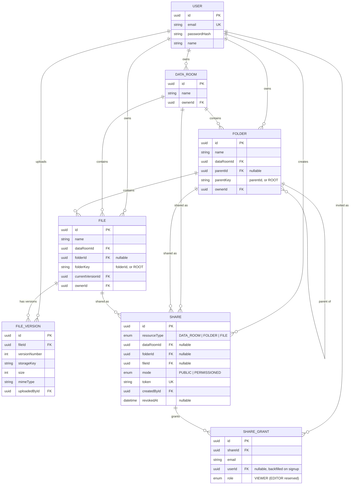

# Vault — Data Room

A virtual data room for due-diligence document sharing: nested folders, PDF uploads with per-file progress and automatic versioning, and read-only sharing via public links or per-person invites.

**Stack**: NestJS + Prisma + PostgreSQL (backend), React + TypeScript + Vite + Tailwind (frontend), S3-compatible object storage, JWT (email/password) auth.

```
backend/    NestJS API
frontend/   React SPA
docker-compose.yml   Postgres + MinIO for local dev
```

## Setup

### Prerequisites
Node 20+, Docker (for local Postgres + MinIO — or point at your own Postgres and S3-compatible bucket instead).

### 1. Infrastructure
```bash
docker compose up -d      # Postgres on :5432, MinIO on :9000 (API) / :9001 (console)
```

### 2. Backend
```bash
cd backend
cp .env.example .env      # defaults already match docker-compose.yml
npm install
npm run db:deploy         # applies migrations
npm run start:dev         # http://localhost:4000/api
```

### 3. Frontend
```bash
cd frontend
cp .env.example .env      # VITE_API_URL=http://localhost:4000/api
npm install
npm run dev                # http://localhost:5173
```

Open two browser sessions (or one normal + one incognito) to try sharing between two accounts. MinIO's console (`localhost:9001`, `dataroom` / `dataroom123`) is useful for watching objects actually land in the bucket.

## Design decisions

**Data rooms are the top-level container.** A `DataRoom` is what the brief calls a "drive" — folders and files with a `null` parent/folder belong directly to its root. A user can own several data rooms; each is invisible to everyone except its owner until explicitly shared.

**Folder/file name uniqueness uses a sentinel key, not `NULL`.** Postgres unique indexes treat `NULL` as distinct from every other `NULL`, so a naive `@@unique([parentId, name])` would silently allow duplicate names at the root of a data room (where `parentId` is `NULL`). Both `Folder` and `File` instead carry a `parentKey`/`folderKey` column that mirrors the real FK but defaults to the literal string `"ROOT"`, so the unique index (`dataRoomId, parentKey/folderKey, name`) catches collisions everywhere, including the root.

**Re-uploading an existing filename creates a new version, it never fails or silently renames.** This is the most natural reading of "uploading files with the same name" for a due-diligence tool — the common case is "here's the updated draft," not "here's an unrelated file that happens to share a name." A `File` row is stable identity; its `FileVersion` children are immutable blobs, and `File.currentVersionId` always points at the newest one. Renaming (not uploading) is where actual name *conflicts* get resolved — with an auto-suffix (`report (1).pdf`), the same convention Drive/Finder/Explorer use, computed by `resolveConflictFreeName` in `common/naming.util.ts`. Folder name conflicts, by contrast, are rejected with a clear 409 rather than silently renamed: folders are structural, and a collision there is worth surfacing to the user explicitly rather than papering over.

**One access-control chokepoint.** Every read path — owned or shared, folder, file, or whole data room — funnels through `AccessService.checkReadAccess`. It resolves a "principal" (an authenticated user, a public share token, or both) against a resource and returns `OWNER` or `VIEWER`, or throws a uniform 404 (never 403) so a share-link guesser can't distinguish "wrong token" from "resource doesn't exist." Write paths funnel through the sibling `assertOwner`, which only ever succeeds for the actual owner — shares are always read-only, by construction, not by convention. Because ownership and sharing rules live in exactly one place, `Folders`/`Files`/`DataRooms`/`Shares` controllers stay thin.

**Sharing is polymorphic over one resource type.** `Share.resourceType` picks which of `dataRoomId` / `folderId` / `fileId` is meaningful; a DB `CHECK` constraint (migration `20260101000001`) enforces that exactly one is set, so a bug in application code can't create an ambiguous share. Nested content resolves access by walking up the folder tree (or checking the flat `dataRoomId`) to see if any ancestor is covered by an active share — see "How it scales" below for the Q&A on cost and extensibility.

**Uploads are one file per HTTP request.** "Multiple files with per-file progress" is much simpler as N parallel `POST /files/upload` calls (each tracked by `axios`'s `onUploadProgress`) than as one multipart request carrying many files — the browser already gives real per-file byte progress for free, and one failed file doesn't affect the others' UI state.

**Deleting a folder that's being viewed by a share recipient.** Folder/file rows cascade-delete in Postgres (`onDelete: Cascade`), which also cascades the `Share` rows scoped to that subtree — a share can't outlive what it points at. Anyone browsing that folder via a share simply gets a 404 on their next request (the frontend renders a "no longer available" empty state rather than a hard crash); there's no dangling reference to clean up. Storage cleanup (the actual S3 objects) happens best-effort *after* the DB delete commits, so the user-visible action never blocks on it, and a partial storage-cleanup failure never leaves an inconsistent DB state — it just leaves orphaned blobs for a future reconciliation job to sweep.

**PDF only.** The brief explicitly says "PDF is enough," so uploads are validated by MIME type server-side and the viewer is a plain `<iframe>` pointed at a presigned S3 URL (browsers render PDFs natively — no client-side PDF.js needed).

## Data model / ERD



Full schema with comments: [`backend/prisma/schema.prisma`](backend/prisma/schema.prisma).

## How it scales

**How do you compute the total size and item count of a folder including its whole subtree?**
A recursive CTE (`WITH RECURSIVE`) walks `parentId` from the target folder down to collect every descendant folder id in one round trip (`FoldersService.getDescendantFolderIds`), then a single aggregate query joins `files` → `file_versions` (on `currentVersionId`) filtered by `folderId = ANY(descendantIds)` to get file count and byte total; folder count is just `descendantIds.length - 1`. This runs on demand — for a whole *data room's* totals, no recursion is needed at all, since every `Folder`/`File` row is tagged with its `dataRoomId` directly (a deliberate denormalization), so that's a flat indexed aggregate regardless of tree depth. At very large scale, the per-folder recursive query is the one that could get expensive on deep/wide trees; the fix is to stop computing it on read and instead maintain denormalized counters (`fileCount`, `folderCount`, `totalSizeBytes`) on `Folder`, updated transactionally on write (or asynchronously via a queue) — trading write-time cost for O(1) reads.

**What changes when one data room holds 100,000 files?**
*Listing/pagination*: file listings already use offset pagination (`page`/`pageSize`, capped at 200/page) rather than returning everything; at this scale I'd switch to keyset/cursor pagination (`WHERE (name, id) > (lastName, lastId) ORDER BY name, id LIMIT n`) since `OFFSET 50000` still has to scan and discard 50,000 rows. *Indexes*: `File` already has `@@index([dataRoomId, folderId])` and the compound unique `(dataRoomId, folderKey, name)` doubles as a lookup index for conflict checks and sorted listing; `Folder` has the equivalent for `parentId`. *Search*: today's `name ILIKE '%q%'` (scoped by an indexed `folderId`/`dataRoomId` prefix) is fine at moderate size but doesn't use an index for the leading wildcard — a trigram GIN index (`pg_trgm`) on `name` would keep partial-match search fast at 100k+ rows. *Uploads*: files are currently buffered in memory (multer `memoryStorage`) before streaming to S3 — fine for PDFs in the tens of MB, but I'd switch to disk-backed streaming or direct browser→S3 presigned-POST uploads to avoid memory pressure at very large scale or file sizes.

**How does sharing extend to per-user roles (viewer/editor) without remodeling?**
It mostly already does. `ShareGrant.role` is a `ShareRole` enum column today with a single value (`VIEWER`), specifically so this doesn't require a schema change later: add `EDITOR` to the enum (an additive migration), then extend `AccessService` with a `checkWriteAccess` counterpart to `checkReadAccess` that, alongside the existing "is the true owner" check, also accepts a matching `ShareGrant` whose `role` is `EDITOR`. No new tables, no resource-type-specific logic — the polymorphic `Share`/`ShareGrant` pair and the `role` column were built to carry this without remodeling.

## Extra credit implemented

- **Search/filter by name** — `GET /data-rooms/:id/search` (whole room, only reachable with room-level access) and `GET /folders/:id/search` (that folder's subtree only, so a folder-scoped share can't be used to search outside what it was shared for).
- **File versioning on name conflicts** — see "Re-uploading an existing filename…" above; version history is browsable per file (`GET /files/:id/versions`), each version individually viewable/downloadable.

## Known limitations / what's next
- Only email/password auth is implemented (no Google OAuth) — the brief allows either.
- Folder moves aren't implemented (only file moves, which the brief requires); adding it is a small extension of the existing move-with-conflict-resolution logic.
- No malware/content scanning on uploads.
- Uploads are memory-buffered server-side rather than streamed (see scaling notes above).

## A note on how AI was used

See [`SCOPE.md`](SCOPE.md) for the division of responsibility between human direction and AI-assisted implementation. In short: this project was built with Claude Code (Anthropic's CLI coding agent), directed by Maksym, who designed the database schema (tables, relations, fields), set the repo's folder structure and frontend component-authoring conventions, and reviewed the generated backend API and frontend components against them. Claude Code implemented the NestJS API, the React frontend, the Prisma syntax/migrations for that schema, and this README, with the output reviewed and corrected along the way rather than accepted blindly.

Before calling it done, the backend was exercised against a *real* Postgres and a *real* S3-compatible server (temporarily, via `embedded-postgres` and `s3rver`, not part of the shipped app) with an end-to-end script covering auth, nested folders, upload + versioning, rename/move conflict resolution, search, public and permissioned sharing (including revocation and the "can't see outside your shared scope" boundary), and cascading delete with storage cleanup. That run caught two real bugs before they shipped: a missing `esModuleInterop` TS setting that made `compression` crash at startup, and a global `ValidationPipe` misconfiguration that rejected the `shareToken` query parameter on paginated endpoints. Both are fixed in the code as it stands. The frontend was type-checked and production-built successfully, but — no browser is available in this environment — it has not been visually verified in an actual browser; please do a quick pass after `npm run dev` before treating the UI/UX as final.
